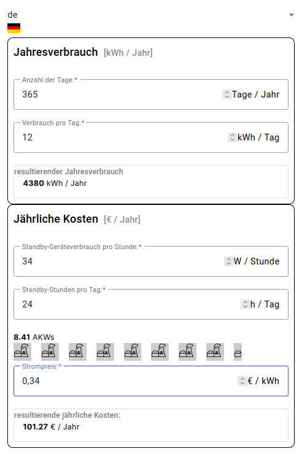

# ECalc

This project was generated with [Angular CLI](https://github.com/angular/angular-cli) version 17.0.5.

It provides a simple form for calculating the electric-power consumption of devices in standby-mode:
* Ability to calculate power consumption of devices in standby-mode
* Calculates the yearly costs of electric power consumption of devices in standby
* Uses internationalization (i18n) for improving user interaction
* GitHub Actions are incorporated for build-automation



## Development server

Run `ng serve` for a dev server. Navigate to `http://localhost:4200/`. The application will automatically reload if you change any of the source files.

## Code scaffolding

Run `ng generate component component-name` to generate a new component. You can also use `ng generate directive|pipe|service|class|guard|interface|enum|module`.

----

# Build-Environment-Setup

## IDE

To build the project or use gitversioning it is recommended that you run the commands in a bash-shell window.

Recommended IDEs are:

* [Intellij Ultimate](https://www.jetbrains.com/idea/download/?section=linux)
* [VSCode](https://code.visualstudio.com/download)

## NPM

* Node.js
* check if you already have npm installed:
  ```npm -v```
* Make sure npm is installed:
  ```sudo apt install npm```

## Installing the Angular Build-tools

* see [Setting up the local environment and workspace](https://angular.io/guide/setup-local)
* install the Angular cli-build-tools using npm:  
  ```sudo npm install -g @angular/cli```
* you can verify the successful installation of _ng_ using:  
  ```ng version```

## Installing Angular-Material
```ng add @angular/material```


# Building

Run `ng build` to build the project. The build artifacts will be stored in the `dist/` directory.

# Continuous Build + Testing

Once you have successfully installed Node.js and the Angular cli-tools, you can complie the project (and automatically open it in your default-browser) by running:  
```ng serve --open```

# Internationalization (i18n)

* Installation of ngx-translate-packages:  
  ```npm install @ngx-translate/core @ngx-translate/http-loader --save```
* [Support for Angular v17](https://github.com/ngx-translate/core/issues/1460)

# GitHub Actions

## GitHub Pages

* [How to deploy an angular app on GitHub Pages using GitHub Actions](https://frontendroom.com/how-to-deploy-angular-app-on-github-pages-using-github-actions/)
* [Easy Steps to Host an Angular App in GitHub Pages](https://www.syncfusion.com/blogs/post/host-angular-app-in-github-pages.aspx)

# GitFlow

The branching schema-used for this project is _git-flow_:

* [git-flow cheatsheet](https://danielkummer.github.io/git-flow-cheatsheet/)

# Links
* [CI/CD for Angular Developers](https://betterprogramming.pub/ci-cd-for-angular-developers-be9a1485d22b)
* [Deploy to GitHub Pages](https://angular.io/guide/deployment#deploy-to-github-pages)
